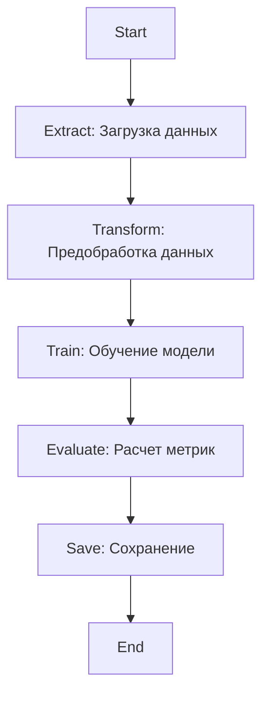

# Data-engineering

## Описание проекта
Проект реализует автоматизированный ETL-процесс для предиктивной модели диагностики рака молочной железы с использованием Apache Airflow. Пайплайн включает загрузку данных, предобработку, обучение модели, оценку качества и сохранение результатов в облачное хранилище.

Решается ML задача бинарной классификации опухолей молочной железы.
Датасет "Breast Cancer Wisconsin Diagnostic" содержит следующие характеристики:

 - 30 числовых признаков
 - Целевая переменная: диагноз (M = malignant, B = benign)

## Архитектура пайплайна


 - Extract: Загрузка данных, валидация данных.
 - Transform: Очистка данных, разделение на тестовую и обучающую выборку, сохранение обработанных данных.
 - Train: Инициализация и обучение модели.
 - Evaluate: Предсказание, расчет метрик.
 - Save: Сохранение.

## ETL-компоненты
`etl/extract.py`
- Загрузка оригинального датасета
- Парсинг CSV с установкой правильных названий колонок
- Валидация структуры данных
---

`etl/transform.py`
- Удаление строк с NaN значениями (полная очистка)
- Проверка на дубликаты
- Кодирование целевой переменной: 
     - `M` → `1` (malignant) 
     - `B` → `0` (benign)
- Нормализация числовых признаков через `StandardScaler`
- Разделение данных на 70% обучающая / 30% тестовая выборки
---
`etl/train.py`
- LogisticRegression с настройкой гиперпараметров
- 5-кратная кросс-валидация
- Отбор признаков по важности
---
`etl/evaluate.py`
- Загрузка тестовых данных и обученной модели
- Расчет метрик качества


## Оркестрация пайплайна
Название DAG "breast_cancer_ml_pipeline".

Пайплайн состоит из 4 последовательных задач, где каждая последующая задача зависит от успешного выполнения предыдущей

---
**Конфигурация выполнения**
- Ежедневный запуск. Возможность ручного запуска.
- Все логи сохраняются в ~logs/breast_cancer_ml_pipeline.
- Параметры выполнения: 3 попытки повтора при неудаче, интервал между попытками 5 минут.
---
Команды для запуска каждого отдельного модуля:
```bash
    airflow tasks test breast_cancer_ml_pipeline extract_task 2025-01-01
    airflow tasks test breast_cancer_ml_pipeline transform_task 2025-01-01
    airflow tasks test breast_cancer_ml_pipeline train_task 2025-01-01
    airflow tasks test breast_cancer_ml_pipeline evaluate_task 2025-01-01
```
## Интеграция с локальным хранилищем данных
- Сохранение артефактов в структурированные папки
- Автоматическое создание необходимых директорий
- При каждом новом запуске пайплайна создается timestamp в формате YYYYMMDD_HHMMSS, все артефакты сохраняются в archived/ с меткой времени, одновременно обновляются файлы в latest.
